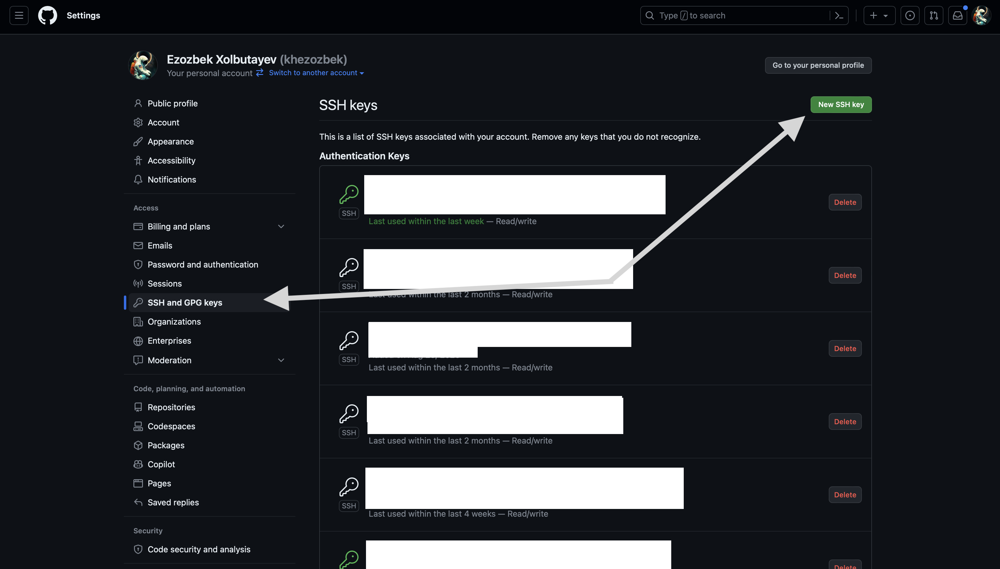
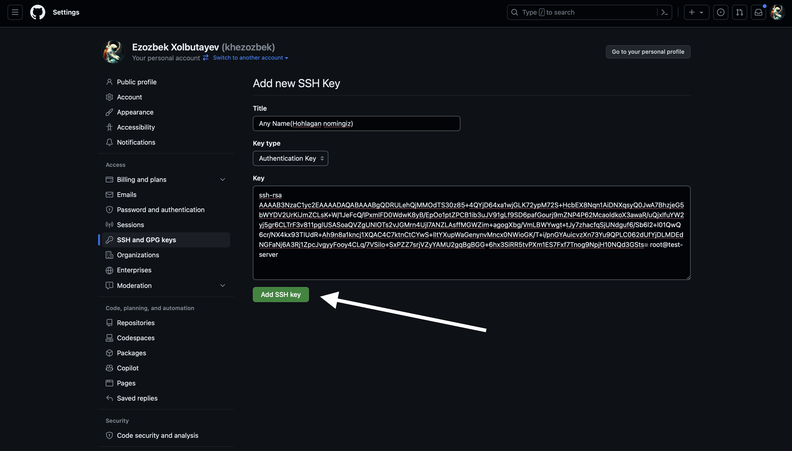
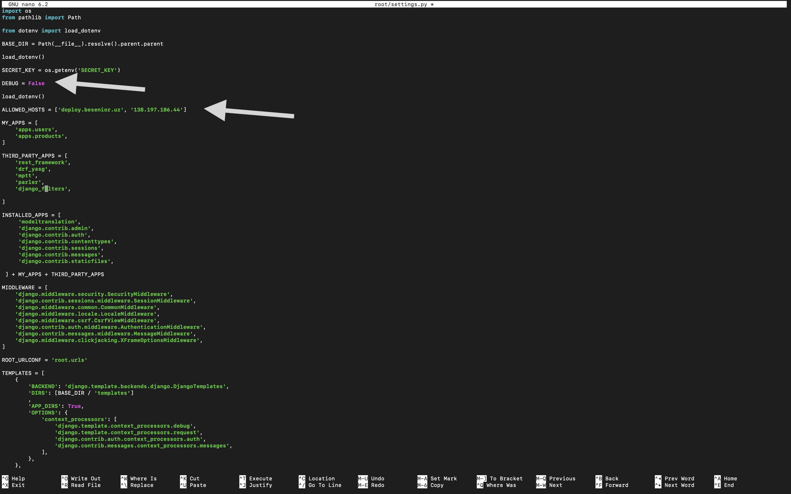
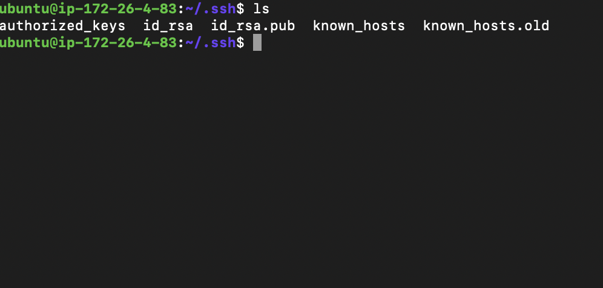
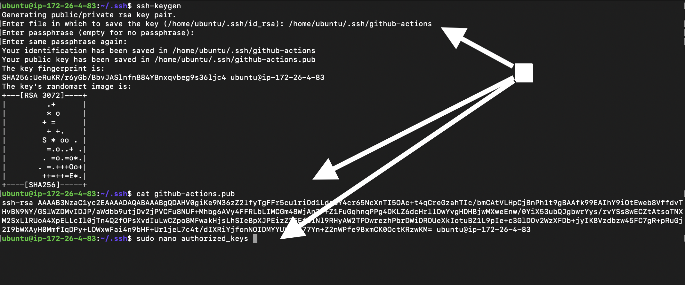
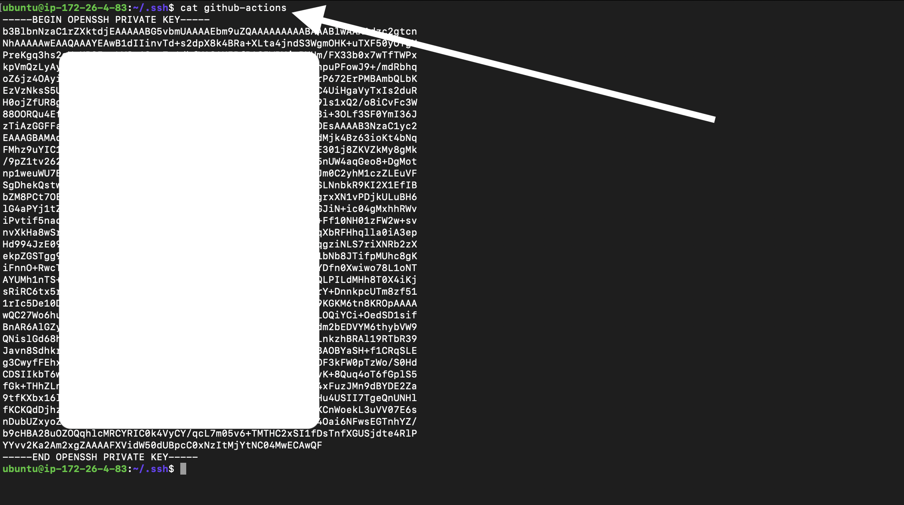
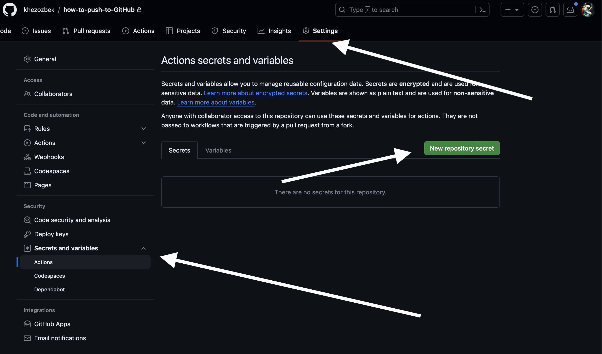
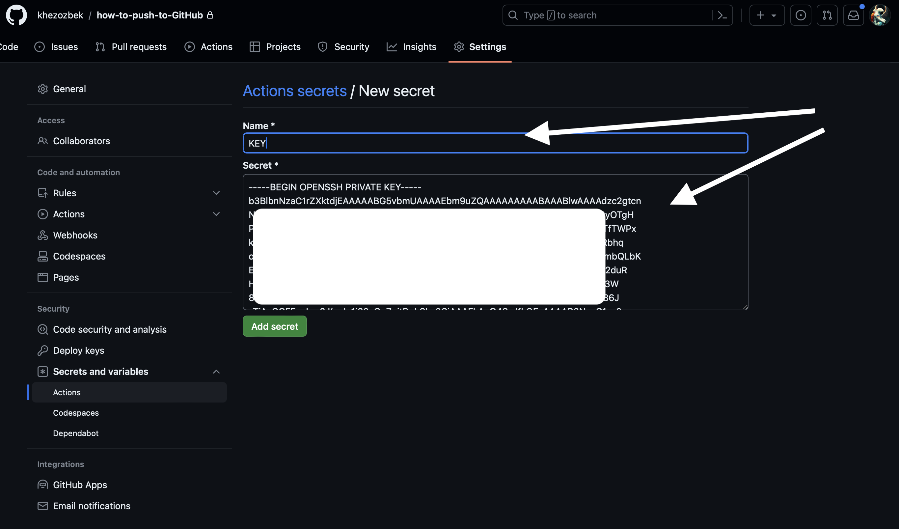

# Digital Oceanga deploy qilish.

##### Digital ocean da yaratilgan serverga bog'lanamiz
- Terminalda yoki Terminus da
- - ``` ssh root@serverning-ip```
a- - - Natija: ``` ezozbek@MacBook ~ % ssh root@138.197.186.44
The authenticity of host '138.197.186.44 (138.197.186.44)' can't be established.
ED25519 key fingerprint is SHA256:6+7rEbO8lOyH3Hb618CT+apkQphvZ8OVQLnS8/4Q+Yk.
This key is not known by any other names.
Are you sure you want to continue connecting (yes/no/[fingerprint])? ```
- - - Yes yoki Y yoziladi va serverga kiriladi.
---
### Serverga kirgandan keyin.
###### Birinchi bo'lib serverni update va bizga kerakli bo'lgan packeglarni o'rnatib olishimiz kerak.

- ```root@test-server:~# sudo apt update ```
- ```root@test-server:~# sudo apt install python3-venv python3.10-venv python3-dev libpq-dev postgresql postgresql-contrib nginx curl```

### DATABASE(Malumodlar ombori)ni yaratish va configuratsiya qilish.
###### Kamandalar terminalga yozilgandan so'ng Loyxamiz uchun DATABASE (Malumodlar obmori) yaratamiz.
- ``root@test-server:~#  sudo -u postgres psql ``
- `` CREATE DATABASE projectname;``
- `` ALTER USER postgres WITH PASSWORD '1'; ``
- `` ALTER ROLE postgres SET client_encoding TO 'utf8';``
- `` ALTER ROLE postgres SET default_transaction_isolation TO 'read committed';``
- `` ALTER ROLE postgres SET timezone TO 'UTC'; ``
- `` GRANT ALL PRIVILEGES ON DATABASE projectname TO postgres ;``
- `` \q `` chiqish uchun.
### Projectni githubdan clone qilishimiz kerak.
######  repositoryni projectni deploy qilish uchun shunchaki projectning repositoryining urlni olish yetarli buning uchun.
- ``root@test-server:~# git clone git@github.com:username/repository-name.git``
###### ssh bog'lashimiz kerak buning uchun: 
```angular2html
cd .ssh/
```
```angular2html
ssh-keygen
```
```angular2html
cat id_rsa.pub
```
- - Chiqgan natija `` ssh-rsa AAAAB3NzaC1yc2EAAAADAQABAAABgQDRULehQjMMOdTS30z85+4QYjD64xa1wjGLK72ypM72S+HcbEX8Nqn1AiDNXqsyQ0JwA7BhzjeG5bWYDV2UrKiJmZCLsK+W/1JeFcQ/lPxmlFD0WdwK8yB/EpOo1ptZPCB1ib3uJV91gLf9SD6pafGourj9mZNP4P62McaoldkoX3awaR/uQjxIfuYW2yj5gr6CLTrF3v811pglUSASoaQVZgUNIOTs2vJGMrn4Ujl7ANZLAsffMGWZim+agogXbg/VmLBWYwgt+tJy7zhacfqSjUNdguf6/Sb6l2+l01QwQ6cr/NX4kx93TIUdR+Ah9n8a1kncj1XQAC4C7ktnCtCYwS+lItYXupWaGenynvMncx0NWioGK/T+i/pnGYAuicvzXn73Yu9QPLC062dUfYjDLMDEdNGFaNj6A3Rj1ZpcJvgyyFooy4CLq/7VSilo+SxPZZ7srjVZyYAMU2gqBgBGG+6hx3SiRR5tvPXm1ES7Fxf7Tnog9NpjH10NQd3GSts= root@test-server``
- - sshni copy (Nusxa)lab.
- 

- - New SSH key button(tugma)si bosilgandan keyin
- 

-----------
# Loyhani o'rnatish.
###### Bunign uchun biz birnichi bo'lib loyha turgan file ga kirib olishimiz kerak.
 - `` root@test-server:~# cd uzum_drf/ `` uzuz_drf/ ning o'rniga sizda github repositoryning nomi bo'ladi.
 - `` root@test-server:~/uzum_drf# python3 -m venv venv `` virtual enviroment(muhit) ni yaratib olamiz.
 - `` root@test-server:~/uzum_drf# source venv/bin/activate `` virtual enviroment(muhit) ni active(faol)ashitirib olamiz.
 - `` (venv) root@test-server:~/uzum_drf# pip3 install -r requirements.txt `` virtual enviroment(muhit) ni ichiga talab qilinga package(kutibxona)larni o'rnatib olishimiz kerak.
 - `` (venv) root@test-server:~/uzum_drf# pip3 install gunicorn psycopg2-binary `` Gunicorn va psycopg2-binary ni o'rnatishimiz kerak.
 
# Loyhani sozlash.
###### biz loyhani qaysi url(manzil) da ishlashi va Production(Ishlab chiqarish) da Debug(Nosozliklarni tuzatish) kerak yani False(Yolg'on) ga o'zgaritishimiz kerak
- ``(venv) root@test-server:~/uzum_drf# sudo nano root/settings.py``
- 
- saqlash uchun va chiqib ketish `CTRL ` + `O` va `CTRL` + `X`
#### Loyhani DATABASE(malumodlar ombori) bilan bog'lanish uchun: 
- ``(venv) root@test-server:~/uzum_drf# python3 manage.py makemigrations``
- ``(venv) root@test-server:~/uzum_drf# python3 manage.py migrate``
#### DATABASE(malumodlar ombori) ga Admin panel orqali kirish uchun superuser yaratish:
- ``(venv) root@test-server:~/uzum_drf# python3 manage.py createsuperuser``
#### Gunicorn loyhamiz uchun ishlayotganini tekshirishimiz kerak.
- ``(venv) root@test-server:~/uzum_drf# gunicorn --bind 0.0.0.0:8000 loyhamiz_nomi.wsgi``
- Agar test muffaciyatli ishlasa ``CTRL`` + ``X`` orqali testni toxtatamiz.- 
- ``(venv) root@test-server:~/uzum_drf# deactivate``
- --------------------------
#### Socket file yozishimiz shart Gunicorn uchun
###### Yani biz Gunicornni django loyhamiz bilan test qilib ko'rdik endi biz django loyhamiz server bilan ishlashi va toxtashi uchun yana ishonchli usuldan foydalanishimiz kerak yani systemd va socket dan.

```angular2html
sudo nano /etc/systemd/system/gunicorn.socket
```
filni ochganimizdan so'ng shu code o'zgarishsiz yozilishi kerak socket filega.
```angular2html
[Unit]
Description=gunicorn socket

[Socket]
ListenStream=/run/gunicorn.sock

[Install]
WantedBy=sockets.target
```

###### Biz endi systemd service yozishimiz kerak Gunicorn uchun 
```angular2html
sudo nano /etc/systemd/system/gunicorn.service
```
```angular2html
[Unit]
Description=gunicorn daemon
Requires=gunicorn.socket
After=network.target

[Service]
User=root
Group=www-data
WorkingDirectory=/root/myprojectdir
ExecStart=/root//myprojectdir/venv/bin/gunicorn \
          --access-logfile - \
          --workers 3 \
          --bind unix:/run/gunicorn.sock \
          root.wsgi:application

[Install]
WantedBy=multi-user.target
```
###### Enable qilishimiz shart /run/gunicorn.sock file yaratish uchun
```angular2html
sudo systemctl start gunicorn.socket
sudo systemctl enable gunicorn.socket
```

###### Gunicornning status(holat)ni tekshirib ko'rsak bo'ladi
```angular2html
sudo systemctl status gunicorn.socket
```

Natija: 
```angular2html
● gunicorn.socket - gunicorn socket
     Loaded: loaded (/etc/systemd/system/gunicorn.socket; enabled; vendor preset: enabled)
     Active: active (listening) since Mon 2022-04-18 17:53:25 UTC; 5s ago
   Triggers: ● gunicorn.service
     Listen: /run/gunicorn.sock (Stream)
     CGroup: /system.slice/gunicorn.socket

Apr 18 17:53:25 django systemd[1]: Listening on gunicorn socket.
```

file /run/gunicorn.sockni yaratganini tekshirib ko'rsak bo'ladi.
```angular2html
file /run/gunicorn.sock
```
Natija: 
```
/run/gunicorn.sock: socket
```

Gunicornning Holatini tekshirishimiz kerak: 
```angular2html
sudo systemctl status gunicorn
```
Natija:
```angular2html
● gunicorn.service - gunicorn daemon
     Loaded: loaded (/etc/systemd/system/gunicorn.service; disabled; vendor preset: enabled)
     Active: active (running) since Mon 2022-04-18 17:54:49 UTC; 5s ago
TriggeredBy: ● gunicorn.socket
   Main PID: 102674 (gunicorn)
      Tasks: 4 (limit: 4665)
     Memory: 94.2M
        CPU: 885ms
     CGroup: /system.slice/gunicorn.service
             ├─102674 /root/myprojectdir/venv/bin/python3 /root/myprojectdir/venv/bin/gunicorn --access-logfile - --workers 3 --bind unix:/run/gunicorn.sock myproject.wsgi:application
             ├─102675 /root/myprojectdir/venv/bin/python3 /root/myprojectdir/venv/bin/gunicorn --access-logfile - --workers 3 --bind unix:/run/gunicorn.sock myproject.wsgi:application
             ├─102676 /root/myprojectdir/venv/bin/python3 /root/myprojectdir/venv/bin/gunicorn --access-logfile - --workers 3 --bind unix:/run/gunicorn.sock myproject.wsgi:application
             └─102677 /root/myprojectdir/venv/bin/python3 /root/myprojectdir/venv/bin/gunicorn --access-logfile - --workers 3 --bind unix:/run/gunicorn.sock myproject.wsgi:application

Sep 18 17:54:49 django systemd[1]: Started gunicorn daemon.
Sep 15 17:10 n:49 django gunicorn[102674]: [2022-04-18 17:54:49 +0000] [102674] [INFO] Starting gunicorn 20.1.0
Sep 15 17:10:49 django gunicorn[102674]: [2022-04-18 17:54:49 +0000] [102674] [INFO] Listening at: unix:/run/gunicorn.sock (102674)
Sep 15 17:10:49 django gunicorn[102674]: [2022-04-18 17:54:49 +0000] [102674] [INFO] Using worker: sync
Sep 15 17:10:49 django gunicorn[102675]: [2022-04-18 17:54:49 +0000] [102675] [INFO] Booting worker with pid: 102675
Sep 15 17:10:49 django gunicorn[102676]: [2022-04-18 17:54:49 +0000] [102676] [INFO] Booting worker with pid: 102676
Sep 15 17:10:50 django gunicorn[102677]: [2022-04-18 17:54:50 +0000] [102677] [INFO] Booting worker with pid: 102677
Sep 15 17:10:50 django gunicorn[102675]:  - - [18/Apr/2022:17:54:50 +0000] "GET / HTTP/1.1" 200 10697 "-" "curl/7.81.0"
```

Gunicron ni qayta ishlastishimiz kerak:
```angular2html
sudo systemctl daemon-reload
sudo systemctl restart gunicorn
```

---------------------------------
## Ngnix file ni Gunicron filega configuratsiya qilishimiz kerak.
Ngnixda yangi server yaratib olishimz kerak.
```angular2html
sudo nano /etc/nginx/sites-available/myproject
```
Va Ngnix ning yangi yaralgan ``myproject`` file ga
```angular2html
server {
    listen 80;
    server_name server_domain_or_IP;

    location = /favicon.ico { access_log off; log_not_found off; }
    location /static/ {
        root /var/www ;
    }

    location / {
        include proxy_params;
        proxy_pass http://unix:/run/gunicorn.sock;
    }
}
```

Va Ngnixni enable qilishimiz mumkin `sites-enabled` filga ga

```angular2html
sudo ln -s /etc/nginx/sites-available/myproject /etc/nginx/sites-enabled
```
Ngnix ni test qilib olamiz
```angular2html
sudo nginx -t
```

Ngnixni restart qilamiz
```angular2html
sudo systemctl restart nginx
```
Ngnix serverimizga 80 porta ishlashga ruxsat berganimizdan keyin 8000 port ni olib tashlashimiz kerak bo'ladi.
```angular2html
sudo ufw delete allow 8000
sudo ufw allow 'Nginx Full'
```

### Loyhamiz domain yoki ip da ishlab turibdi agar ishlmagan bo'lsa error log ni ko'rishimiz va docs ga qaytib errorni tog'rilashimz mumkin.
```angular2html
sudo tail -F /var/log/nginx/error.log
```
-----------------
## Loyhamiz uchun SSL/TLS certificateni olishimz kerak.

1-qadam - Certbotni o'rnatish
```angular2html
sudo snap install core; sudo snap refresh core
```
- Agar bizda certbotning boshqa versiyalari bo'ladigan bo'lsa 
```angular2html
sudo apt remove certbot
```
- Certbot ni o'rnatishimiz kerak endi 
```angular2html
sudo snap install --classic certbot
```
- Siz certbot buyrug'ini tezkor o'rnatish katalogidan o'z yo'lingizga bog'lashingiz mumkin, shuning uchun uni faqat certbot yozish orqali ishga tushirishingiz mumkin. Bu barcha paketlar uchun kerak emas, lekin sukut bo'yicha snaplar kamroq bezovta bo'ladi, shuning uchun ular tasodifan boshqa tizim paketlariga zid kelmaydi:
```angular2html
sudo ln -s /snap/bin/certbot /usr/bin/certbot
```
----------------
## 2 - qadam | HTTPSga ruxsat berish hafsizlik tomonlam.

Ko'rishimiz mumkin.
```angular2html
sudo ufw status
```

HTTPSga ruxsatlarni berishimz kerak va HTTP dan ruxsatlarni olishimiz kerak.
```angular2html
sudo ufw allow 'Nginx Full'
sudo ufw delete allow 'Nginx HTTP'
```

Statusni ko'rishimiz mumkin:
```angular2html
sudo ufw status
```
-----------------
3 - Qadam | SSL sertifikatini olish.
```angular2html
sudo certbot --nginx -d sizningdomainginiz.com
```
- Natija: 
```angular2html
IMPORTANT NOTES:
Successfully received certificate.
Certificate is saved at: /etc/letsencrypt/live/your_domain/fullchain.pem
Key is saved at: /etc/letsencrypt/live/your_domain/privkey.pem
This certificate expires on 2022-06-01.
These files will be updated when the certificate renews.
Certbot has set up a scheduled task to automatically renew this certificate in the background.

- - - - - - - - - - - - - - - - - - - - - - - - - - - - - - - - - - - - - - - -
If you like Certbot, please consider supporting our work by:
* Donating to ISRG / Let's Encrypt: https://letsencrypt.org/donate
* Donating to EFF: https://eff.org/donate-le
```
----------------
## 4 - Qadam | yangilanishlarni automatik tekshirish.
Shifrlash sertifikatlari faqat to'qson kun davomida amal qiladi. Bu foydalanuvchilarni sertifikatni yangilash jarayonini avtomatlashtirishga undashdir. Biz o'rnatgan certbot paketi kuniga ikki marta ishlaydigan tizim taymerini qo'shish va o'ttiz kun ichida muddati tugaydigan har qanday sertifikatni avtomatik ravishda yangilash orqali biz uchun bu haqda g'amxo'rlik qiladi.

Taymer holatini systemctl bilan so'rashingiz mumkin:
```angular2html
sudo systemctl status snap.certbot.renew.service
```

Yangilash jarayonini sinab ko'rish uchun siz certbot bilan quruq ishga tushirishingiz mumkin:

```angular2html
sudo certbot renew --dry-run
```
## Va biz SSL Sertificatini oldilk.

-------------------

## Deploy ga CI & CD yozishimiz kerak.

CI & CD Github ning Actions hisoblanadi biz CI & CD ni biz deployment qilishda vahtni tejash va samaradorlikni oshirish maqsadida ishlatamiz.
PS: Oylab ko'ring agar siz loyhada biror bir o'zgarish qildingiz va siz CI & CD yozmagansiz shuning uchun siz serverga kirib terminaldan github dagi project ni clone qilib olishingniz kerak. Agar sizda CI & CD bo'lsa loyhani shunchaki github ga push qilishingiz yetarli bo'ladi 😎.

## CI yozishimiz kerak Continuous Integration(uzluksiz integratsiya)
Uzluksiz integratsiya (CI) umumiy omborga tez-tez kod berishni talab qiladigan dasturiy ta'minot amaliyotidir. Kodni tez-tez kiritish xatolarni tezroq aniqlaydi va xato manbasini topishda ishlab chiquvchi disk raskadrovka qilishi kerak bo'lgan kod miqdorini kamaytiradi. Tez-tez yangilanadigan kodlar, shuningdek, dasturiy ta'minotni ishlab chiqish guruhining turli a'zolari tomonidan kiritilgan o'zgarishlarni birlashtirishni osonlashtiradi. Bu kod yozish uchun ko'proq vaqt va xatolarni tuzatish yoki birlashma nizolarini hal qilish uchun kamroq vaqt sarflashi mumkin bo'lgan ishlab chiquvchilar uchun juda yaxshi.

Kodni omboringizga topshirganingizda, majburiyat xatoliklarga olib kelmasligiga ishonch hosil qilish uchun kodni doimiy ravishda yaratishingiz va sinab ko'rishingiz mumkin. Sizning testlaringiz kod linterlarini (uslub formatlashni tekshiradi), xavfsizlik tekshiruvlarini, kod qamrovini, funktsional testlarni va boshqa maxsus tekshiruvlarni o'z ichiga olishi mumkin.

Kodni yaratish va sinab ko'rish uchun server kerak. Kodni omborga yuborishdan oldin yangilanishlarni mahalliy ravishda yaratishingiz va sinab ko'rishingiz mumkin yoki siz omborda yangi kodlar mavjudligini tekshiradigan CI serveridan foydalanishingiz mumkin.

### Loyhamiz turgan manzilda .github/workflows/ file ni ochib olamiz va shu file ni ichiga ci.yml nomli file ni yochamiz

ci.yml ga PyCharm yoki VS code orqali kirsak bo'ladi

CI ning ichiga 

```xml
name: PROJECT CI

on: [push]

jobs:
  run-test:
    services:
      postgres:
        image: postgres:14.8
        env:
          POSTGRES_DB: database nomi
          POSTGRES_USER: data base user
          POSTGRES_PASSWORD: paroli
        ports:
          - 5432:5432

    runs-on: ubuntu-latest
    env:
      DJANGO_SETTINGS_MODULE: root.settings
    steps:
      - uses: actions/checkout@v2
      - uses: actions/setup-python@v2
        with:
          python-version: 3.10.5
      - name: Install requirements
        run: pip3 install -r requirements.txt
```

CI yozdik va buni github ga push qilsak github repositorymizning ichida actions qismida automatic ko'rinib run bo'layotgan bo'ladi.

## CD action continuous deployment (Uzluksiz joylashtirish) haqida


GitHub Actions yordamida uzluksiz joylashtirish haqida

Siz dasturiy mahsulotingizni joylashtirish uchun GitHub Actions ish jarayonini sozlashingiz mumkin. Mahsulotingiz kutilganidek ishlashini tekshirish uchun ish jarayoni sizning omboringizda kodni yaratishi va joylashtirishdan oldin testlarni o'tkazishi mumkin.

Siz GitHub hodisasi sodir bo'lganda (masalan, yangi kod omboringizning standart bo'limiga yuborilganda), belgilangan jadval bo'yicha, qo'lda yoki tashqi hodisa sodir bo'lganda, omborni jo'natish veb kancasi yordamida CD ish jarayonini sozlashingiz mumkin. Ish oqimingiz qachon ishga tushishi haqida ko'proq ma'lumot olish uchun "Ish oqimlarini ishga tushiradigan hodisalar" ga qarang.


### CD ni yozish uchun biz .github/workflows/ file ga kelib cd.yml degan file yaratishimiz kerak
```xml
name: PROJECT CD

on:
  push:
    branches: [master]

jobs:
  test:
    services:
      postgres:
        image: postgres:14.8
        env:
          POSTGRES_DB: database nomi
          POSTGRES_USER: data base user
          POSTGRES_PASSWORD: paroli
        ports:
          - 5432:5432

    runs-on: ubuntu-latest
    env:
      DJANGO_SETTINGS_MODULE: root.settings
    steps:
      - uses: actions/checkout@v2
      - uses: actions/setup-python@v2
        with:
          python-version: 3.10.5
      - name: Install requirements
        run: pip3 install -r requirements.txt

  deploy:
    runs-on: ubuntu-latest
    needs: test
    steps:
      - name: connect and deploy
        uses: appleboy/ssh-action@v1.0.0
        with:
          host: sizningdominginiz.com yoki .uz
          username: root
          key: ${{ secrets.KEY }}
          script: |
            cd loyha/
            git pull
            sudo systemctl restart gunicorn.socket gunicorn.service
```

CD ishlashi uchun biz ``KEY`` qo'shishimiz kerak
buning uchun biz serverda ``cd .ssh/`` qilib ssh file ga kirib olamiz va



## va yangi ssh key yaratamiz github-actions nomli
## github-actions.pub ni copy(nusxa)lab authorized_key ga post qilamiz

## github-actions ning private keyni copy qilib

## github repositoryning settings qismiga kelib yangi secret qo'shamiz.



## Va biz CD ni ham github ga push qilsak bo'ladi va har push bo'lganda serverda ham o'zgarishlar amalga oshirliadi.
